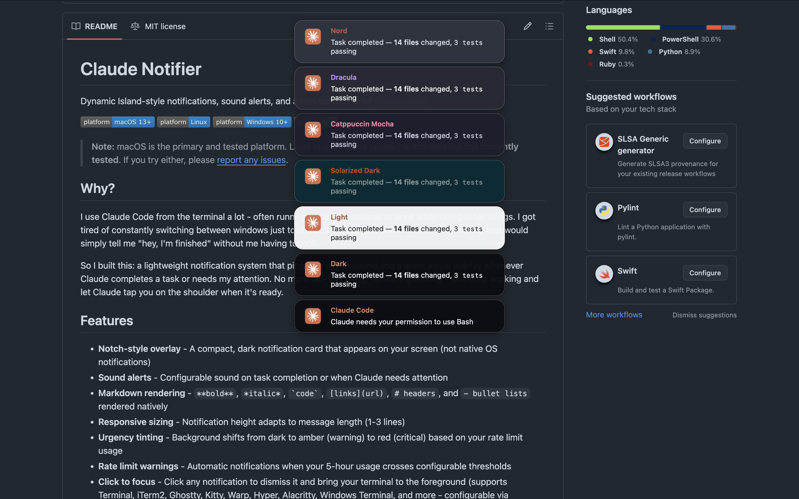

# Claude Tap

Dynamic Island-style notifications, sound alerts, and a rich status line for [Claude Code](https://docs.anthropic.com/en/docs/claude-code).


> **Note:** macOS is the primary and tested platform. Linux and Windows support is included but **not currently tested**. If you try either, please [report any issues](https://github.com/EdoardoCroci/claude-tap/issues).

<p align="center">
  
  <br>
  <em>6 built-in theme presets — or define your own with custom RGBA colors</em>
</p>

## Why?

I use Claude Code from the terminal a lot - often running multiple instances at once while doing other things. I got tired of constantly switching between windows just to check if Claude was done. I wanted something that would simply tell me "hey, I'm finished" without me having to look.

So I built this: a lightweight notification system that pings me with a sound and a quick visual overlay whenever Claude completes a task or needs my attention. No more tab-switching, no more guessing - just keep working and let Claude tap you on the shoulder when it's ready.

## Features

- **Notch-style overlay** - A compact, dark notification card that appears on your screen (not native OS notifications)
- **Sound alerts** - Configurable sound on task completion or when Claude needs attention
- **Markdown rendering** - `**bold**`, `*italic*`, `` `code` ``, `[links](url)`, `# headers`, and `- bullet lists` rendered natively
- **Responsive sizing** - Notification height adapts to message length (1-3 lines)
- **Urgency tinting** - Background shifts from dark to amber (warning) to red (critical) based on your rate limit usage
- **Rate limit warnings** - Automatic notifications when your 5-hour usage crosses configurable thresholds
- **Click to focus (session-aware)** - Click any notification to dismiss it and raise the **specific** terminal window/tab the notification came from, not just the terminal app. iTerm2 is targeted by session UUID; Terminal.app by tty; Ghostty, VS Code, Warp, Kitty and others are targeted via macOS Accessibility (matches the window whose title contains the session's cwd). First click after install triggers a macOS Accessibility permission prompt for `notch-notify` — grant it under System Settings → Privacy & Security → Accessibility. Denying falls back to the old "activate the app generically" behaviour.
- **Smart suppression** - Notifications are skipped when your terminal is already focused
- **Do Not Disturb** - Scheduled quiet hours and manual DND toggle to silence notifications
- **Notification history** - All notifications logged to a local JSON file with a built-in viewer
- **Custom sounds per event** - Different sounds for task complete, needs attention, and rate limit warnings
- **Notification stacking** - Multiple notifications stack vertically instead of overlapping
- **Theme presets** - Dark, Light, Solarized, Catppuccin, Dracula, Nord — or custom RGBA
- **Auto-theme** - Automatically switch between day/night themes based on time of day
- **Sound preview** - Hear and adjust your notification sound during the install wizard
- **Auto-update** - Version checking and one-command updates from GitHub
- **One-liner install** - `curl ... | bash` for quick setup on macOS and Linux
- **Rich status line** - Context window %, rate limits with countdown timers (e.g., `2h34m` or `3d4h17m`), lines changed
- **Fully configurable** - Colors, position, sounds, duration, thresholds, and more via a single JSON file
- **Cross-platform** - Native implementations for macOS (Swift/AppKit), Linux (Python/GTK3), and Windows (PowerShell/WPF)

## Requirements

### macOS

- **macOS 13+** (Ventura or later)
- **Xcode Command Line Tools** - install with `xcode-select --install`
- **Claude Code** with hooks support
- **jq** - for the status line (`brew install jq`)

### Linux (not currently tested)

- **Python 3** - for notification overlay and config parsing
- **PyGObject + GTK3** - for the custom overlay (optional — falls back to `notify-send`)
  - Debian/Ubuntu: `apt install python3-gi gir1.2-gtk-3.0`
  - Fedora: `dnf install python3-gobject gtk3`
  - Arch: `pacman -S python-gobject gtk3`
- **Claude Code** with hooks support
- **jq** - for the status line (`apt install jq` / `dnf install jq` / `pacman -S jq`)
- **Sound** (optional): `paplay` (PulseAudio), `pw-play` (PipeWire), or `aplay` (ALSA)

### Windows (not currently tested)

- **Windows 10+**
- **PowerShell 5.1+** (ships with Windows)
- **Claude Code** with hooks support

## Quick Start

### Homebrew (macOS) — recommended

```bash
brew tap EdoardoCroci/tap
brew install claude-tap
claude-tap-setup
```

`brew install` downloads the source and installs `jq` as a dependency. `claude-tap-setup` copies assets, compiles the Swift notification binary, writes a default config (`~/.config/claude-tap/config.json`), and registers hooks in `~/.claude/settings.json`. Restart Claude Code and run `/hooks` to verify.

To customize notification position, sounds, themes, and more:

```bash
claude-tap-configure
```

### One-liner (macOS / Linux)

```bash
curl -fsSL https://raw.githubusercontent.com/EdoardoCroci/claude-tap/main/install-remote.sh | bash
```

This clones the repo to `~/.local/share/claude-tap` and runs the interactive setup wizard. Restart Claude Code and run `/hooks` to verify.

### Manual (macOS)

```bash
git clone https://github.com/EdoardoCroci/claude-tap.git
cd claude-tap/macos
./install.sh
```

### Manual (Linux — not currently tested)

```bash
git clone https://github.com/EdoardoCroci/claude-tap.git
cd claude-tap/linux
./install.sh
```

### Manual (Windows — not currently tested)

```powershell
git clone https://github.com/EdoardoCroci/claude-tap.git
cd claude-tap\windows
powershell -ExecutionPolicy Bypass -File install.ps1
```

The manual and one-liner installers walk you through an interactive setup wizard where you choose notification position, sounds, status line sections, rate limit thresholds, and colors. Restart Claude Code and run `/hooks` to verify.

To re-run the setup wizard:

```bash
# Homebrew
claude-tap-configure

# Manual / One-liner (macOS / Linux)
./install.sh --reconfigure

# Windows
powershell -ExecutionPolicy Bypass -File install.ps1 -Reconfigure
```

## Project Structure

```
claude-tap/
├── README.md
├── LICENSE
├── config.example.json            # Reference config (shared format)
├── VERSION                        # Version number (for auto-update)
├── install-remote.sh              # One-liner remote installer
├── homebrew/                      # Homebrew formula
│   └── claude-tap.rb
├── scripts/                       # Cross-platform utilities
│   ├── history.sh                 # Notification history viewer
│   ├── update.sh                  # Update checker (macOS/Linux)
│   └── update.ps1                 # Update checker (Windows)
├── assets/                        # Shared assets
│   ├── claude-icon.png
│   ├── screenshots/               # README images
│   └── sounds/default.wav
├── macos/                         # macOS implementation
│   ├── install.sh                 # Interactive setup wizard
│   ├── setup.sh                   # Non-interactive setup (claude-tap-setup)
│   ├── configure.sh               # Reconfigure wrapper (claude-tap-configure)
│   ├── uninstall.sh
│   └── src/
│       ├── NotchNotification.swift
│       ├── notify.sh
│       └── statusline.sh
├── linux/                         # Linux implementation
│   ├── install.sh
│   ├── uninstall.sh
│   └── src/
│       ├── notification.py        # GTK3 overlay (Python)
│       ├── notify.sh
│       └── statusline.sh
├── windows/                       # Windows implementation (not tested)
│   ├── install.ps1
│   ├── uninstall.ps1
│   └── src/
│       ├── NotchNotification.ps1
│       ├── notify.ps1
│       └── statusline.ps1
└── docs/
    ├── CONFIGURATION.md
    ├── HOOKS.md
    └── TROUBLESHOOTING.md
```

All three platforms read the same `config.json` format, so the configuration documentation applies to all of them.

## What Gets Installed

| What | macOS | Linux | Windows |
|------|-------|-------|---------|
| Notification overlay | `~/.config/claude-tap/notch-notify` (compiled Swift) | `~/.config/claude-tap/notification.py` (Python) | *(runs from repo)* |
| Config file | `~/.config/claude-tap/config.json` | `~/.config/claude-tap/config.json` | `%LOCALAPPDATA%\claude-tap\config.json` |
| Icon + sound | `~/.config/claude-tap/` | `~/.config/claude-tap/` | `%LOCALAPPDATA%\claude-tap\` |
| Hook entries | `~/.claude/settings.json` | `~/.claude/settings.json` | `~/.claude/settings.json` |

On macOS, the Swift binary is compiled at install time. On Linux, the Python overlay script is copied to the config directory. On Windows, PowerShell scripts run directly.

### File permissions

On macOS and Linux, the installer sets restrictive permissions on all files in `~/.config/claude-tap/`:

| File | Permission | Reason |
|------|-----------|--------|
| `config.json` | `0600` (owner read/write) | May contain custom paths and preferences |
| `history.json` | `0600` (owner read/write) | Contains snippets of Claude's responses |
| `claude-icon.png`, `default.wav` | `0600` (owner read/write) | Assets — no need for other users to access |
| `notch-notify` (macOS) | `0755` (owner execute) | Compiled binary |
| `notification.py` (Linux) | `0700` (owner execute) | Overlay script |

On Windows, files inherit the user profile's default ACLs — typically only the current user has access.

## Configuration

Edit `~/.config/claude-tap/config.json` to customize. **Changes take effect immediately** - no recompile or restart needed.

### Key options

| Setting | Default | Description |
|---------|---------|-------------|
| `notification.enabled` | `true` | Show/hide the visual overlay |
| `notification.position` | `"top-center"` | `"top-center"`, `"top-left"`, `"top-right"`, `"bottom-center"`, `"bottom-left"`, `"bottom-right"` |
| `notification.width` | `380` | Notification width in points |
| `notification.max_lines` | `3` | Maximum message lines (1-5) |
| `notification.corner_radius` | `16` | Corner rounding in points |
| `notification.duration_seconds` | `5.5` | How long the notification stays visible |
| `notification.icon` | `""` (bundled Claude icon) | Path to a custom PNG icon |
| `notification.colors` | *(see config)* | RGBA colors for normal/warning/critical states |
| `sound.enabled` | `true` | Play sound on notification |
| `sound.file` | `default.wav` | Path to any `.wav` or `.aiff` file |
| `sound.volume` | `0.15` | Volume from 0.0 to 1.0 |
| `sound.files.stop` | `""` | Custom sound for task complete (falls back to `sound.file`) |
| `sound.files.notification` | `""` | Custom sound for needs attention |
| `sound.files.rate_limit_warning` | `""` | Custom sound for rate limit warnings |
| `rate_limits.warning_threshold` | `80` | 5h usage % that triggers amber warning |
| `rate_limits.critical_threshold` | `90` | 5h usage % that triggers red warning |
| `skip_if_focused` | `true` | Skip notifications when terminal is focused |
| `quiet_hours.enabled` | `false` | Enable scheduled quiet hours |
| `quiet_hours.start` | `"22:00"` | Quiet hours start (HH:MM, 24h) |
| `quiet_hours.end` | `"07:00"` | Quiet hours end (HH:MM, 24h) |
| `history.enabled` | `true` | Log all notifications to history.json |
| `history.max_entries` | `100` | Max entries to keep in history |
| `history.clear_after_days` | `30` | Auto-delete entries older than N days (0 = never) |
| `theme.auto` | `false` | Auto-switch themes based on time of day |
| `theme.day` / `theme.night` | `"light"` / `"dark"` | Theme names for day and night |
| `theme.day_start` / `theme.night_start` | `"08:00"` / `"18:00"` | When to switch (HH:MM, 24h) |
| `auto_update.check_on_install` | `true` | Check for updates when running installer |
| `auto_update.notify_only` | `true` | Only notify about updates, don't auto-pull |
| `terminal_apps` | *(see config)* | Terminal identifiers (bundle IDs on macOS, process names on Windows) |
| `status_line.enabled` | `true` | Enable/disable the entire status line |
| `status_line.show_context_bar` | `true` | Show context window progress bar |
| `status_line.show_rate_5h` | `true` | Show 5-hour rate limit |
| `status_line.show_rate_7d` | `true` | Show 7-day rate limit |
| `status_line.show_lines_changed` | `true` | Show lines added/removed |
| `status_line.show_git_branch` | `true` | Show current git branch |

See [docs/CONFIGURATION.md](docs/CONFIGURATION.md) for the complete reference.

### Color format

Colors are specified as `[R, G, B, A]` arrays with values from `0.0` to `1.0`:

```json
"background": [0.05, 0.05, 0.07, 0.96]
```

Each urgency level (`normal`, `warning`, `critical`) has four color roles: `background`, `border`, `title`, `text`.

## Customization Examples

### Move notification to bottom-right

```json
{
  "notification": {
    "position": "bottom-right"
  }
}
```

### Use a system sound

```json
// macOS
{ "sound": { "file": "/System/Library/Sounds/Glass.aiff" } }

// Windows
{ "sound": { "file": "C:\\Windows\\Media\\chimes.wav" } }
```

### Disable sound, keep visual notification

```json
{
  "sound": {
    "enabled": false
  }
}
```

### Blue-tinted notification background

```json
{
  "notification": {
    "colors": {
      "normal": {
        "background": [0.04, 0.05, 0.12, 0.96],
        "border": [0.3, 0.4, 0.8, 0.15]
      }
    }
  }
}
```

### Custom notification icon

```json
{
  "notification": {
    "icon": "~/Pictures/my-icon.png"
  }
}
```

### Enable quiet hours (no notifications 11 PM - 8 AM)

```json
{
  "quiet_hours": {
    "enabled": true,
    "start": "23:00",
    "end": "08:00"
  }
}
```

Or toggle DND manually anytime:

```bash
# Enable DND
touch ~/.config/claude-tap/dnd

# Disable DND
rm ~/.config/claude-tap/dnd
```

### Earlier rate limit warnings

```json
{
  "rate_limits": {
    "warning_threshold": 60,
    "critical_threshold": 80
  }
}
```

### Add a custom terminal app

**macOS** - find bundle ID:
```bash
osascript -e 'id of app "YourTerminal"'
```

**Windows** - use the process name (visible in Task Manager):
```json
{
  "terminal_apps": ["WindowsTerminal", "pwsh", "YourTerminal"]
}
```

## How It Works

```
Claude Code
    |
    |-- Stop hook ----------> notify script ----> Reads config
    |                              |                   |
    |                              |-- play sound <----|
    |                              |                   |
    |                              '-- notification <--' (visual overlay)
    |                                     |
    |                                     '-- Reads ~/.config/claude-tap/config.json
    |                                         at runtime for colors, position, duration
    |
    |-- Notification hook --> (same as above)
    |
    '-- Status line -------> statusline script --> Reads config
                                  |                     |
                                  |-- Outputs ANSI-colored line
                                  |
                                  '-- Triggers rate limit warnings
                                      when thresholds are crossed
```

On macOS, the notification overlay is a compiled Swift binary using AppKit. On Linux, it is a Python script using GTK3 (with `notify-send` fallback). On Windows, it is a PowerShell script using WPF. All platforms read the same config format.

## Updating

### Homebrew

```bash
brew upgrade claude-tap
claude-tap-setup
```

`brew upgrade` pulls the latest source. `claude-tap-setup` recompiles the binary and refreshes hooks. Your config is preserved.

### Manual / One-liner

```bash
cd claude-tap    # or ~/.local/share/claude-tap for one-liner installs
git pull

# macOS
cd macos && ./install.sh

# Linux
cd linux && ./install.sh

# Windows
cd windows
powershell -ExecutionPolicy Bypass -File install.ps1
```

`git pull` updates the scripts in place. Re-running the installer recompiles the binary on macOS. Your config is preserved — the installer skips the wizard if a config already exists. Pass `--reconfigure` to change settings.

The installer also checks for updates automatically when run (if `auto_update.check_on_install` is `true` in your config). You can check manually:

```bash
./scripts/update.sh --check-only   # check only
./scripts/update.sh                # check and update
```

## Uninstalling

### Homebrew

```bash
claude-tap-uninstall
brew uninstall claude-tap
brew untap EdoardoCroci/tap        # optional, removes the tap
```

`claude-tap-uninstall` removes hooks and config. `brew uninstall` removes the formula.

### Manual / One-liner

```bash
# macOS
cd claude-tap/macos && ./uninstall.sh

# Linux
cd claude-tap/linux && ./uninstall.sh

# Windows
cd claude-tap\windows
powershell -ExecutionPolicy Bypass -File uninstall.ps1
```

This removes hooks from `~/.claude/settings.json`, deletes `~/.config/claude-tap/` (config, binary, assets), and cleans up temp files. The cloned repo folder is left for you to delete manually (`rm -rf claude-tap` or `rm -rf ~/.local/share/claude-tap` for one-liner installs).

## Testing

Send a test notification:

### macOS

```bash
# Normal
~/.config/claude-tap/notch-notify "Hello" "It works!" ~/.config/claude-tap/claude-icon.png

# Warning (amber tint)
~/.config/claude-tap/notch-notify "Warning" "Rate limit at 82%" ~/.config/claude-tap/claude-icon.png warning

# Critical (red tint)
~/.config/claude-tap/notch-notify "Critical" "Rate limit at 95%!" ~/.config/claude-tap/claude-icon.png critical

# Markdown
~/.config/claude-tap/notch-notify "Test" "**Bold**, *italic*, and \`code\`" ~/.config/claude-tap/claude-icon.png
```

### Linux (not currently tested)

```bash
# GTK3 overlay
python3 ~/.config/claude-tap/notification.py "Hello" "It works!" ~/.config/claude-tap/claude-icon.png

# With urgency
python3 ~/.config/claude-tap/notification.py "Warning" "Rate limit at 82%" ~/.config/claude-tap/claude-icon.png warning

# Fallback (notify-send)
notify-send "Hello" "It works!" --icon=~/.config/claude-tap/claude-icon.png
```

### Windows (not currently tested)

```powershell
$dir = "$env:USERPROFILE\.config\claude-tap"
powershell -ExecutionPolicy Bypass -File windows\src\NotchNotification.ps1 -Title "Hello" -Message "It works!" -IconPath "$dir\claude-icon.png"
```

## Troubleshooting

See [docs/TROUBLESHOOTING.md](docs/TROUBLESHOOTING.md) for common issues and solutions.

## License

MIT - see [LICENSE](LICENSE).
